# Unpaired Image-to-Image Translation (CycleGAN)

Tensorflow 2.0 implementation of [Unpaired Image-to-Image Translation
using Cycle-Consistent Adversarial Networks](https://arxiv.org/pdf/1703.10593.pdf), 
aka. CycleGAN, with the original implementation at 
[pytorch-CycleGAN-and-pix2pix](https://github.com/junyanz/pytorch-CycleGAN-and-pix2pix).

CycleGAN makes it possible to translate an image from a source domain *X* to 
target domain *Y*, without the need of paired datasets, by learning the mapping
*G*: *X* --> *Y* such that images from *G(X)* cannot be told apart from *Y*.
Well, that's the idea anyway...

## Samples

### Horse -> Zebra

<p align="center">
    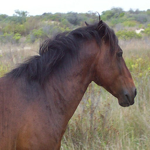
    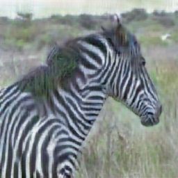
    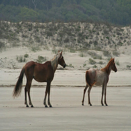
    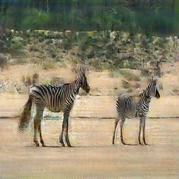
    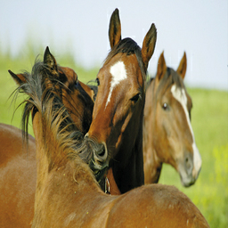
    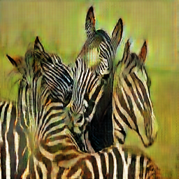
    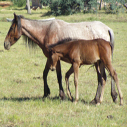
    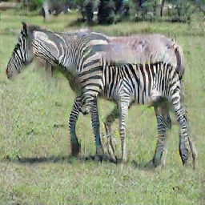
</p>

### Zebra -> Horse

<p align="center">
    
    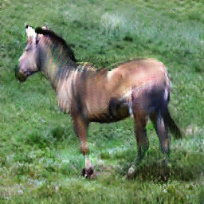
    
    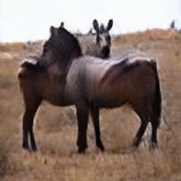
    
    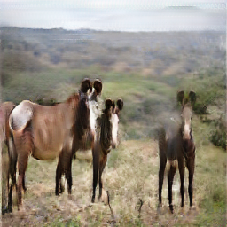
    
    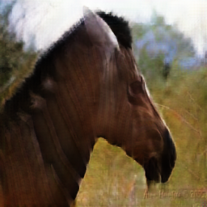
</p>

## Requirements

Create a Python 3 virtual environment and activate it:

```bash
virtualenv -p python3 venv
source ./venv/bin/activate
```

Next, install the required dependencies:

```bash
pip install -r requirements.txt
```

## Usage

To transform images from the test set using a pre-trained model specify the log directory containing model checkpoints.

### Style image

```bash
python transform.py \
    --log-dir log/dir/ \
    --num-samples 5
```

### Train model

```bash
python train.py \
    --log-dir log/dir/ \
    --dataset horse2zebra
```

To track metrics, start `Tensorboard`

```bash
tensorboard --logdir log/dir/
```

and navigate to [localhost:6006](localhost:6006).

